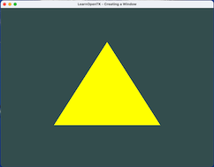
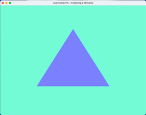
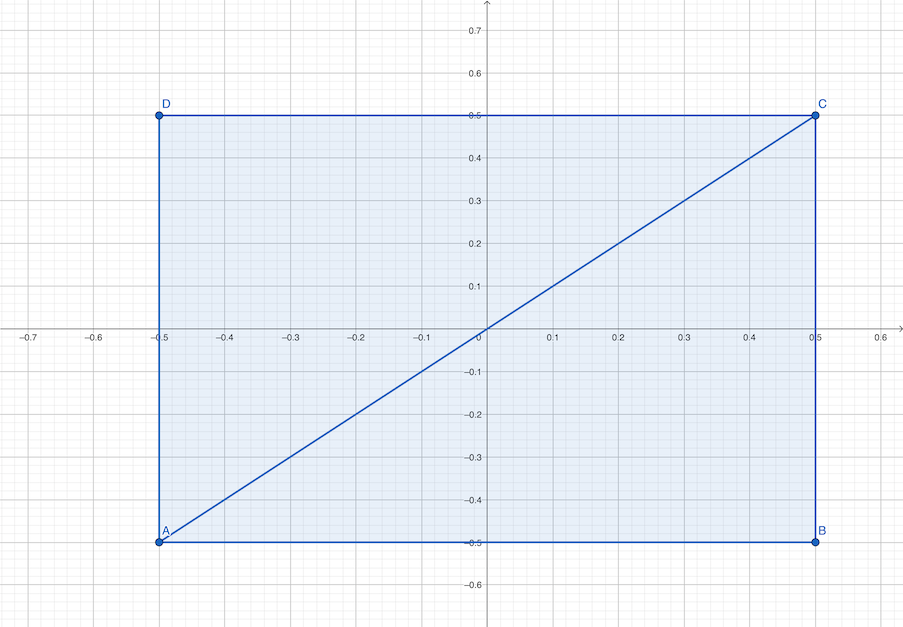

# Computação Gráfica - Unidade 2  

Conceitos básicos de Computação Gráfica: estruturas de dados para geometria, sistemas de coordenadas na biblioteca gráfica (OpenGL/OpenTK), primitivas básicas (vértices, linhas, polígonos, círculos e curvas cúbicas – splines).  

Objetivo: aplicar os conceitos básicos de sistemas de referências e modelagem geométrica em Computação Gráfica.  

## Material  

[cg-slides_u2.pdf](./cg-slides_u2.pdf "cg-slides_u2.pdf")  
[anotações do quadro](aulaAnotacoesQuadro)  

## Ambiente de Desenvolvimento

Para iniciar as atividades precisamos configurar o [Ambiente de Desenvolvimento](AmbienteDesenvolvimento.md "Ambiente de Desenvolvimento")  

### OpenTK - Testar Ambiente

Agora que já temos o [Ambiente de Desenvolvimento](AmbienteDesenvolvimento.md "Ambiente de Desenvolvimento") instalado vamos testá-lo usando alguns projetos de exemplo.  

#### 1-CreatingAWindow

Cria uma janela usando o OpenTK.  
Ver a pasta: [1-CreatingAWindow](OpenTK/Chapter1/1-CreatingAWindow)  
Este projeto usar a definição de Shaders: [OpenTK/Common](OpenTK/Common)  

Diagrama de Classes:  
  

#### 2-HelloTriangle

Exibe a representação de um triângulo usando OpenTK.  
Ver a pasta: [2-HelloTriangle](OpenTK/Chapter1/2-HelloTriangle)  
Este projeto usar a definição de Shaders: [OpenTK/Common](OpenTK/Common)  

Diagrama de Classes:  
  

#### Atividade de Teste

Usando o fonte do projeto: **2-HelloTriangle** faça.

##### Exercício A

- Mudar a cor  
  fundo:  
    R: 115      <!-- 115/256 = 0.44921875 -->
    G: 252      <!-- 252/256 = 0.98437500 -->
    B: 214      <!-- 214/256 = 0.83593750 -->
  triângulo:  
    R: 122      <!-- 122/256 = 0.47656250 -->  
    G: 129      <!-- 129/256 = 0.50390625 -->
    B: 255      <!-- 255/256 = 0.99609375 -->

Antes - Depois  
   

#### Exercício B

- Desenhar um quadrado em vez de um triângulo usando os pontos abaixo:  
<https://www.geogebra.org/geometry/ef2ghh35>  
  

## [Atividades - Aula](Atividade2/README.md "Atividades - Aula")  

----------

## ⏭ [Unidade 3)](../Unidade3/README.md "Unidade 3")  

## Principais Referências Bibliográficas​

O material utilizado nesta disciplina é baseado nessas Referências Bibliográficas​.  

### Links OpenGL

- OpenGL: <https://en.wikipedia.org/wiki/OpenGL>  
- OpenGL (aprendendo): <https://learnopengl.com/>  
- OpenGL (aprendendo, livro): <https://learnopengl.com/book/book_pdf.pdf>
- OpenGL (aprendendo, GitHub): <https://github.com/JoeyDeVries/LearnOpenGL>  
- Khronos: <https://www.khronos.org/api/opengl>  

### Links OpenTK

- OpenTK: <https://opentk.net/>  
- OpenTK GitHub: <https://github.com/opentk>  
- OpenTK FAQ: <https://opentk.net/faq.html>  
- OpenTK FAQ (usando OpenTK): <https://opentk.net/faq.html#installing-and-using-opentk>  
- OpenTK (aprendendo): <https://opentk.net/learn/index.html>  
- OpenTK (aprendendo, GitHub): <https://github.com/opentk/LearnOpenTK>  
- OpenTK (API): <https://opentk.net/api/index.html>  

### Links OpenTK fontes

- OpenTK (fontes, não usar): <https://github.com/opentk/opentk>  

### Links IDE VSCode

<https://github.com/dalton-reis/projetoEnsino/tree/main/_._/VSCode>  

### Links C\#

<https://github.com/dalton-reis/projetoEnsino/tree/main/_._/CSharp>  

## Rabiscos

